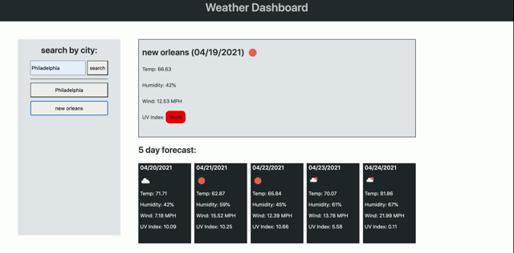

## Overview
This application displays current and forcast weather for a specified region by pulling data from the Open Weather API. If the user has not previously searched the city then it will be saved to the quick search button section to be recalled for later use. 

## Deployed Site
[Weather Dashboard](https://skrtz.github.io/weather-dashboard/)

## Tech Used
- HTML  
- CSS  
- Primer  
- Javascript  
- Moment JS  
- Jquery  
- Open Weather API  